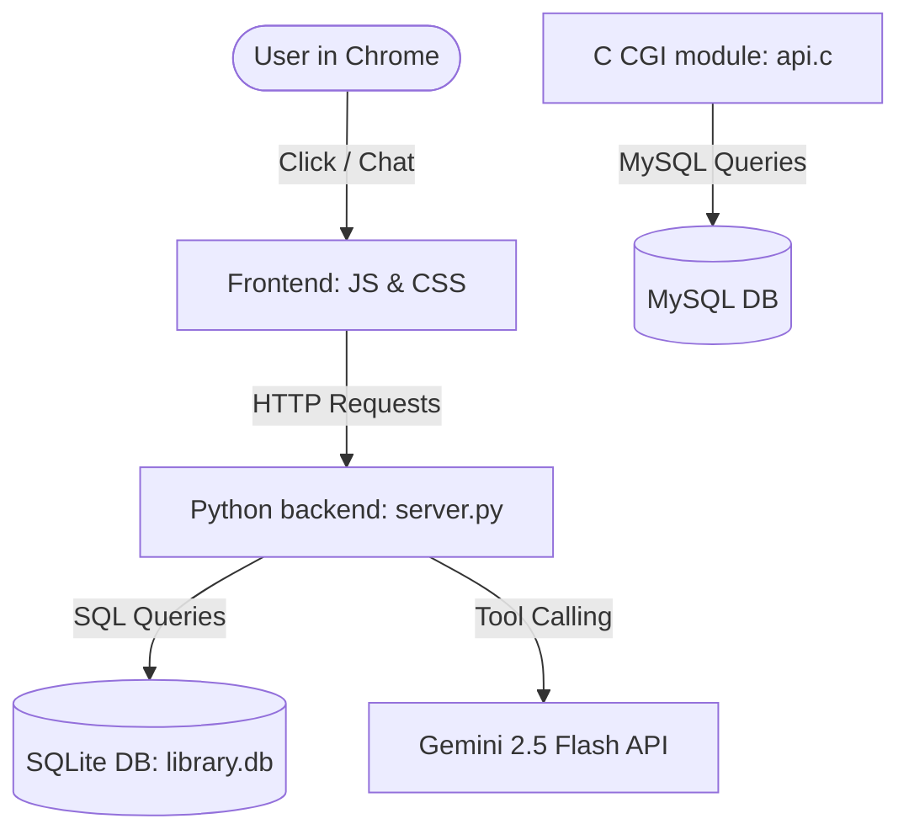

# 🚀 Book Matrix - The Future of Library Management

Welcome to **Book Matrix**! This is a state-of-the-art, responsive, and beautiful Library Management System (LMS) designed to transition traditional paper-based libraries into a high-tech digital workspace. Built with clean, modern aesthetics (using glassmorphism) and integrated with Google's Gemini Artificial Intelligence, Book Matrix makes managing book inventories, tracking members, and issuing/returning books extremely easy and interactive.

---

## 📖 How the System Works (For Everyone!)
Imagine you are running a school or public library. Instead of writing checkouts in a notebook, Book Matrix gives you a dashboard. 
1. **Adding Books:** You register books with details like title, author, price, and stock quantity.
2. **Registering Members:** You add students, teachers, and staff into the database.
3. **Checking Out (Issue) & Returning:** When a student wants a book, you record the issue transaction. When they return it, the system checks if they returned it on time. If it is late, it calculates a daily fine automatically!
4. **AI Assistant:** Patrons or administrators can chat with a virtual assistant. The assistant can look at database statistics, find books, and give recommendations instantly!

---

## 🛠️ Technology Stack & Languages Used
We use different programming languages, each doing a specific job:

| Technology | Language | What it does in Book Matrix |
| :--- | :--- | :--- |
| **Frontend UI** | HTML5 | The skeleton of the site—arranges the sidebars, tables, buttons, and sections. |
| **Styling** | CSS3 | The styling layer—adds colors, shadows, rounded corners, responsive grid layouts, and glassmorphic blur effects. |
| **Client Logic** | JavaScript (ES6) | The brains of the browser—fetches data from the server, updates the screen without reloading, and displays interactive charts (using Chart.js). |
| **Backend Web Server** | Python | The coordinator—listens for browser requests, queries the database, runs backups, and communicates with Google Gemini. |
| **Database** | SQLite | The storage vault—a file-based SQL database storing all library inventory and transactions. |
| **Auxiliary Backend** | C (api.c) | Educational CGI API—uses C and `mysql.h` to connect to a MySQL database and sort inventory records using Bubble Sort. |

---

## 🧠 Step-by-Step Architecture & AI Integration
Book Matrix splits operations between client-side user actions and backend processing:



### 1. Backend Endpoints (API Paths)
- **`GET /api?action=dashboard`:** Aggregates statistics (total books, copies, active loans, overdue books).
- **`GET /api?action=get_books`:** Searches and filters the book database.
- **`POST /api?action=issue_book`:** Registers a book loan.
- **`POST /api?action=return_book`:** Processes a book return and calculates fine rates.
- **`POST /api?action=db_backup` / `db_restore`:** Manually archives or recovers the database.

### 2. Business Logic and Validation Rules
To prevent errors or human mistakes, the backend enforces several rules:
- **Stock Check:** A book's `available_quantity` must be greater than 0 before being checked out.
- **Loan Limitations:** Members cannot borrow more than the maximum amount specified in the library configurations.
- **Fine Calculation:** When a book is returned, if `actual_return_date` is later than `return_date`, the system computes: 
  $$\text{Total Fine} = (\text{Days Late}) \times (\text{Daily Fine Rate})$$

---

## 🧮 Algorithms & Computational Complexity
We use specific mathematical and computational algorithms to keep the library database fast, responsive, and organized.

### 1. Sorting Algorithm: Bubble Sort (in C backend `api.c`)
- **How it works:** It compares adjacent book records by their database IDs and swaps them if they are in the wrong order. It continues looping through the array until no more swaps are needed.
- **Where it is used:** Sorting inventory records returned from the MySQL database before sending them to the browser.
- **Complexity Analysis:**
  - **Worst-Case Time Complexity:** $O(N^2)$ (when the book list is in reverse order).
  - **Average-Case Time Complexity:** $O(N^2)$ (general random distribution).
  - **Best-Case Time Complexity:** $O(N)$ (when books are already sorted).
  - **Space Complexity:** $O(1)$ auxiliary space (it performs the sort directly in the allocated array without using additional memory).

### 2. Intent Recognition: Local NLP Fallback Engine (in Python backend `server.py`)
- **How it works:** It uses regular expressions (Regex) and pattern matching to check the user's chat message for key terms (e.g., "how many books", "who is borrowing"). If it finds matching keywords, it runs the corresponding database query.
- **Where it is used:** Acting as a backup assistant when the user has no internet connection or the Gemini API is unavailable.
- **Complexity Analysis:**
  - **Time Complexity:** $O(R \times L)$ where $R$ is the number of query templates/rules and $L$ is the length of the user's message.
  - **Space Complexity:** $O(1)$ auxiliary space.

### 3. Database Searching: B-Tree Indexing (SQLite Database Engine)
- **How it works:** It organizes database tables in a hierarchical tree structure. Rather than checking every single row one by one, it halves the search scope at each step of the tree.
- **Where it is used:** Running fast searches for book titles, authors, and transaction logs.
- **Complexity Analysis:**
  - **Time Complexity:** $O(\log N)$ where $N$ is the number of records in the database. Without indexing, this falls back to a linear search: $O(N)$.
  - **Space Complexity:** $O(1)$ auxiliary space.

### 4. Cache Invalidation: Hot-Reload Cache Busting
- **How it works:** It appends a dynamic version token (e.g., `style.css?v=2026_edge_fixed`) to resource links. The browser sees this parameter and knows it must fetch the fresh file rather than reading a stale, cached stylesheet from its memory.
- **Where it is used:** Used across HTML templates to keep CSS and JS files synchronized immediately during updates.
- **Complexity Analysis:**
  - **Time Complexity:** $O(1)$ (instant query construction).
  - **Space Complexity:** $O(1)$.

---

## 🚀 Getting Started Locally
1. Ensure you have **Python 3.x** installed.
2. Navigate to the root directory and start the server:
   ```bash
   python backend/server.py
   ```
3. Open Google Chrome and go to: **`http://localhost:8083/`**
